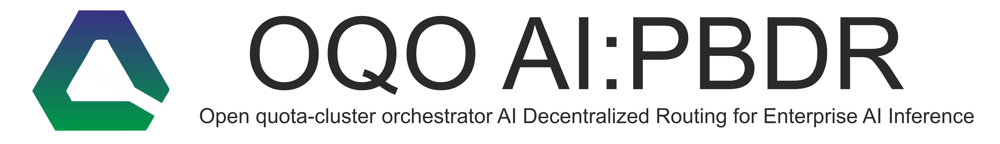
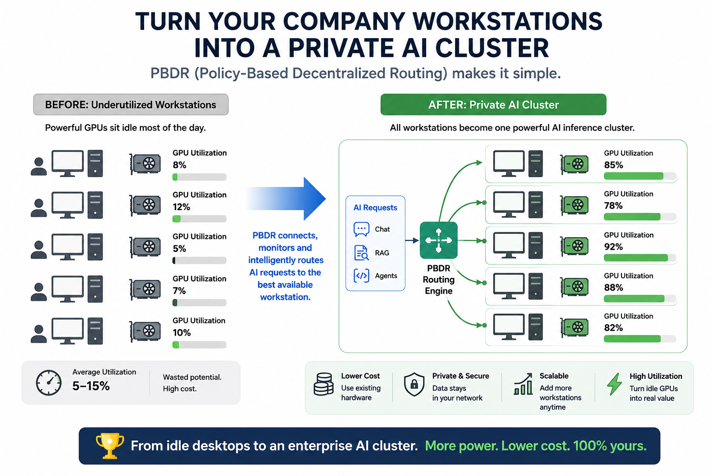
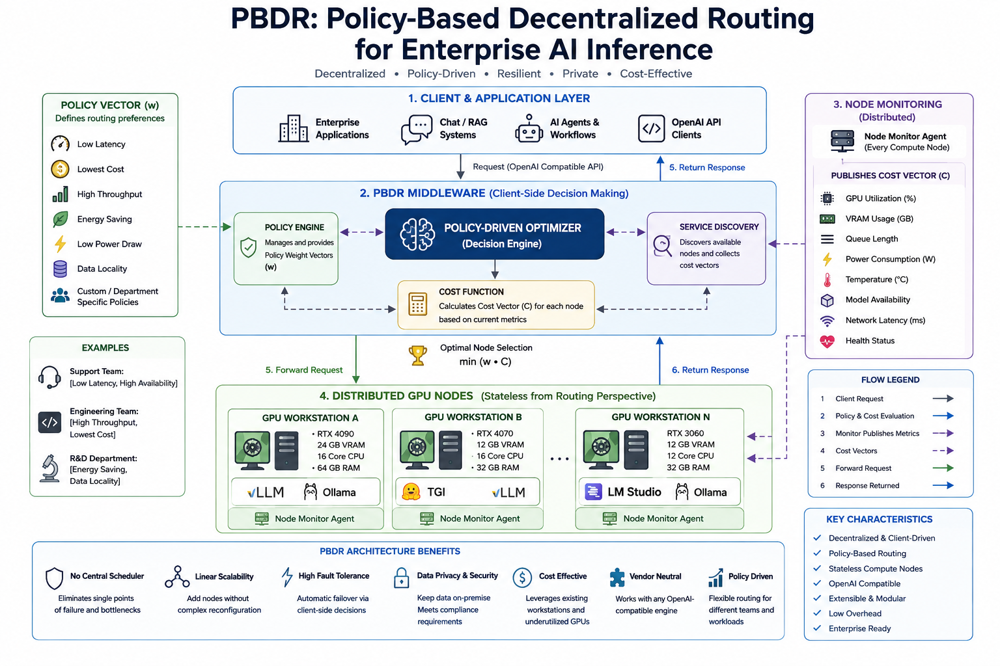
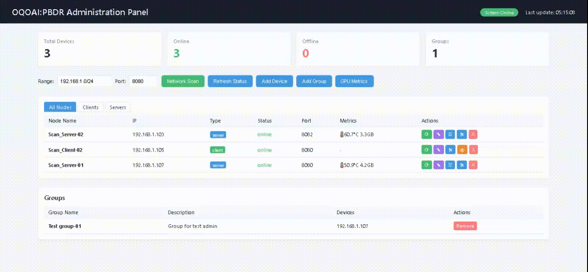

# OQOAI-PBDR Оpen quota-cluster orchestrator AI - Decentralized Routing for Enterprise AI Inference

[](https://opensource.org/licenses/MIT)
[](https://github.com/oqo-ai/OQOAI-PBDR/actions/workflows/test.yml)
[](https://www.python.org/)
[](https://github.com/oqo-ai/OQOAI-PBDR/releases)
[](http://makeapullrequest.com)


> ⚡ **Turn idle corporate GPUs into a private, fault-tolerant AI cluster**  
> 📦 **Zero-dependency setup in <30 seconds**  
> 🎯 **Policy-based routing with 10+ cost dimensions**

**OQOAI:PBDR** is an open-source, decentralized, and cross-platform system designed for AI traffic routing within enterprise computing infrastructure. It leverages existing hardware — workstations, servers, and GPU nodes — to create a unified AI cluster without requiring additional investment in specialized infrastructure. By implementing a state-of-the-art Policy-Based Decentralized Routing (PBDR) architecture, OQOAI ensures intelligent, policy-driven distribution of inference requests across heterogeneous environments, supporting both Linux and Windows platforms.


# PBDR Architecture


**Policy-Based Decentralized Routing** is an intelligent LLM request routing system built on the principles of decentralization and policy-oriented management. The system automatically distributes load across servers, taking into account GPU state, queue congestion, available models, and numerous other factors in real time.

> 🚀 **Core Idea:** Policy-based routing rather than static rules. Each request receives the most suitable node based on a comprehensive cost vector of 10+ parameters and policies.

> **Use Case:** Install the software on corporate workstations and launch a local AI cluster on idle resources.
---

## Project Concept

**Project Concept** — The rapid progress of large language models (LLMs) has unlocked transformative potential for various enterprise applications: from intelligent assistants and code generation to retrieval-augmented generation (RAG) systems for internal knowledge bases. However, widespread deployment of these models in enterprise environments faces significant obstacles:

**High Infrastructure Costs**: Deploying on-premise specialized AI clusters requires substantial investment in servers with expensive enterprise-grade GPUs (e.g., NVIDIA A100, H100). The capital expenditure lacks a realistic ROI model.

**Data Privacy and Security Concerns**: Concerns about data leakage and regulatory compliance (e.g., GDPR, HIPAA, SOC2) often prohibit the use of public third-party AI APIs. On-premise deployment is frequently a strict requirement.

**Underutilized Resources**: Many workstations used by engineers, designers, and researchers are equipped with increasingly powerful consumer GPUs (e.g., RTX 3060, 4070, 4090). These GPUs often sit idle or underutilized 75-95% of the time. A significant portion of the required computational resources already exists within the corporate network but remains unused.

Thus, the growing demand for on-premise large language models (LLMs) and other AI services in enterprise environments is constrained by high infrastructure costs, data privacy concerns, and underutilization of existing computational resources.

The PBDR architecture enables the transformation of corporate workstations with GPUs, networked within the company, into a private, fault-tolerant, and cost-effective AI cluster for AI inference tasks, without the need for dedicated infrastructure.

The PBDR architecture is characterized by the following features:

● **Decentralization**: No central scheduler, load balancer, or task queue. This eliminates single points of failure and performance-limiting bottlenecks.

● **Client-Side Decision Making**: Routing logic resides on the client side (or middleware acting on its behalf), which computes the cost (priority) for each node based on its current state.

● **Policy-Based Management**: Routing logic is not fixed; it is defined by a configurable policy vector. This allows different departments (e.g., support and engineering) or applications to employ different routing strategies.

● **Modularity**: The system is designed for extensibility and is compatible with any AI engine that supports the OpenAI API (e.g., vLLM, TGI, Ollama).

● **Stateless Nodes**: From a routing perspective, compute nodes are stateless, simplifying management, replacement, and scaling.

> **Further Reading:** Scientific publication dedicated to the implemented architecture "PBDR Policy-Based Decentralized Routing for Enterprise AI Inference" http://doi.org/10.17513/doi.26.



---

## 🌟 Key Features

### 📊 Intelligent Routing
- **10-dimensional cost vector** considers latency, throughput, GPU/CPU utilization, VRAM availability, temperature, and other metrics
- **Adaptive Exploration** — balances between exploiting the best node and exploring alternatives
- **Hard Constraints** — automatic filtering of nodes by model availability, VRAM, context length, and queue state

### 🎛️ Flexible Policy Management
- **Swappable policies** in real-time via API or web interface
- **Preset policies:** `balanced`, `latency`, `throughput`, `cost`, `experimental`
- **Custom policies** with configurable weights for all 10 parameters

### 🖥️ Centralized Administration
- **Web admin dashboard** with real-time monitoring
- **Network scanning** for automatic node discovery
- **Bulk management** of configurations and policies for device groups
- **GPU metric graphs** (temperature, utilization, VRAM usage)

### 🔧 Supported Backends
- **Ollama API** — full compatibility
- **OpenAI API** (llama.cpp, vLLM, TGI)
- **Automatic API type detection**

### 🛡️ Fault Tolerance
- **Versioned protocol** (ETag/If-Version) for minimal traffic
- **Automatic recovery** on node unavailability
- **State caching** on the client side

---

## 📊 Comparison

| Feature | PBDR | Kubernetes | NGINX LB | Custom Solution |
|---------|------|------------|----------|-----------------|
| GPU-aware routing | ✅ | ❌ | ❌ | ⚠️ |
| Policy-based routing | ✅ | ❌ | ⚠️ | ⚠️ |
| Zero configuration | ✅ | ❌ | ❌ | ❌ |
| Decentralized architecture | ✅ | ❌ | ❌ | ⚠️ |
| <30s deployment | ✅ | ❌ | ❌ | ❌ |
| Real-time GPU metrics | ✅ | ⚠️ | ❌ | ⚠️ |
| Automatic node discovery | ✅ | ⚠️ | ❌ | ❌ |
| Multi-model support | ✅ | ❌ | ❌ | ⚠️ |
| Enterprise-grade security | ✅ | ✅ | ✅ | ⚠️ |
| Open source (MIT) | ✅ | ✅ | ✅ | ❌ |

---

## 💡 Use Cases

### 🏢 Enterprise RAG Systems
- Deploy on 100 engineer workstations
- 10 servers serve 100 clients with 90% cost reduction
- Keep sensitive data within corporate network

### 🔬 Research & Development Labs
- Utilize idle GPUs during off-hours
- Dynamic model loading based on research demand
- Support multiple teams with different model requirements

### 🏥 Healthcare & HIPAA Environments
- On-premise deployment, no data leaves the network
- Audit-ready architecture with transparent logging
- Compliance with data protection regulations

### 🎓 Educational Institutions
- Cost-effective AI infrastructure for students
- Shared GPU pool across departments
- Support for various AI workloads (NLP, CV, etc.)

### 🏭 Manufacturing & Industry 4.0
- Local AI inference for quality control
- Low-latency edge computing
- Predictive maintenance with local LLMs

---

## Project Advantages

**GPU Resource Utilization**
Massive savings through the use of idle corporate computational resources. ROI for local generation: Just 10% of workstations equipped with GPUs can meet the entire cluster's needs for RAG generation tasks (e.g., 10 servers for 100 clients).

**System Decentralization**
All nodes operate independently and dynamically form optimal routes. There is no single point of failure, such as a central node. A server can simultaneously act as both a client node and a server node.

**Instant Start, Dependency-Free Launch in <30 Seconds**
Linux support — binary build
Windows support — binary build

**Open and Transparent Source Code**
Nano-architecture with 3 files of ~1,000 lines each. Simple, transparent code with no abstractions, ensuring fast information security audits and compliance control.

**Simple Administration**
Network administration supports remote management and configuration distribution to nodes.

**Full Compatibility with Popular AI APIs**
Out-of-the-box support for popular AI data exchange formats: OpenAI API, Ollama API, Comfy, etc.

**No Network Localization Restrictions**
Ability to connect remote nodes outside the corporate network, as well as cloud generation services.

**Open Source**
Open MIT license for the core, allowing published PBDR builds to be incorporated into your projects without restrictions.

**Scientific Contribution**
The project authors are the creators of the PBDR architecture described at http://doi.org/10.17513/doi.26, providing a practical scientific contribution to the advancement of AI infrastructure technologies.

---

## 🏗️ Architecture



### Components

| Component | Description | Port |
|-----------|-------------|------|
| **PBDR Server** | Worker node with GPU, executes LLM requests | e.g., 8080 (monitor), 11434 (API) |
| **PBDR Client** | Intelligent request router | e.g., 8080 |
| **PBDR Admin** | Web-based management and monitoring dashboard | e.g., 8081 |

---

## 📦 Installation

### Requirements
- Python 3.8+
- [Ollama](https://ollama.com/) or [llama.cpp](https://github.com/ggerganov/llama.cpp) server

### Quick Start

```bash
# Clone repository
git clone https://github.com/oqo-ai/OQOAI-PBDR.git
cd pbdr
```

---

Repeat the installation process for all devices you wish to use.

You need to deploy at least 1 PBDR server on a device with an LLM server installed (Ollama, llama.cpp, etc.), at least 1 PBDR client on a device with an LLM client installed (Open WebUI, etc.), and 1 PBDR administration server on any device with a browser.

All devices on which the software is deployed must be on the same network and have static IP addresses.
Note: It is recommended to use 1 PBDR server with ollama, 1 PBDR server with llama.cpp, and 1 PBDR client for routing tests.
Next, proceed to the first launch section.

---

## 🚀 Launch

### 1. Launch PBDR Server (on each GPU node)

```bash
# Start server
# Linux:
chmod +x ./pbdr_server_OAA4_en
./pbdr_server_OAA4_en pbdr_server_config_test.json

# Windows:
pbdr_server_OAA4_en.exe pbdr_server_config_test.json
```

### 2. Launch PBDR Client (router)

```bash
# Configure LLM server IP addresses in the client configuration. Specify IP addresses and ports of the nodes where PBDR servers are deployed.

# Linux:
chmod +x ./pbdr_server_OAA4_en
./pbdr_client_OAA5_en pbdr_client_config_test.json

# Windows:
pbdr_client_OAA5_en.exe pbdr_client_config_test.json

# Verify server configuration
# "servers": [{"host": "192.168.1.100", "monitor_port": 8080, "api_port": 11434}]

```

### 3. Launch PBDR Admin (web dashboard)

```bash
# Start administration server

# Linux:
chmod +x ./pbdr_admin3_en
./pbdr_admin3_en pbdr_admin_config_test.json

# Windows:
pbdr_admin3_en.exe pbdr_admin_config_test.json

# Open web interface in browser. After startup, the admin dashboard will be available at http://<admin server IP>:8081
```

---

## 🎯 Usage Examples

### Sending a Request via Client (OpenAI API)

```bash
curl http://localhost:8080/v1/chat/completions \
  -H "Content-Type: application/json" \
  -d '{
    "model": "llama3.1:8b",
    "messages": [{"role": "user", "content": "What is the capital of France?"}],
    "stream": false
  }'
```

### Getting Server Status

```bash
curl http://192.168.1.100:8080/status
```

### Changing Policy via Admin API

```bash
curl -X POST http://localhost:8081/api/apply-policy-all \
  -H "Content-Type: application/json" \
  -d '{"policy": "latency"}'
```

---

## Routing Policies

The system supports swappable policies through a 10-dimensional cost vector:

| Parameter | Description | Default Weight |
|-----------|-------------|----------------|
| `c1` | Waiting time | 1.0 |
| `c2` | Inference time | 1.0 |
| `c3` | Cold start (model loading) | 0.5 |
| `c4` | Queue length penalty | 0.3 |
| `c5` | GPU utilization penalty | 0.4 |
| `c6` | CPU utilization penalty | 0.2 |
| `c7` | VRAM shortage penalty | 2.0 |
| `c8` | GPU temperature penalty | 0.1 |
| `c9` | Idle bonus | -0.5 |
| `c10` | Network latency penalty | 0.1 |
| `c11-` | Extended options | 0.1 | 
| `-c20` | cost vector parameters | 0.1 |

### Preset Policies

- **`balanced`** — balance between speed and quality
- **`latency`** — minimal response latency
- **`throughput`** — maximum throughput
- **`cost`** — resource efficiency
- **`experimental`** — high exploration coefficient

---

## 📈 Performance

| Metric | Value |
|--------|-------|
| Routing decision latency | <5ms |
| Node discovery interval | 1s |
| Policy switch time | <100ms |
| MTBF (Mean Time Between Failures) | >99.9% |
| Maximum cluster size | 1000+ nodes |
| State cache TTL | Configurable (default: 5s) |
| Network overhead per node | <1 KB/s |
| CPU overhead | <2% per 100 nodes |

### Scalability Benchmarks

| Cluster Size | Discovery Time | Memory Usage | CPU Usage |
|--------------|---------------|--------------|-----------|
| 10 nodes | <100ms | ~10MB | <1% |
| 50 nodes | <500ms | ~50MB | <2% |
| 100 nodes | <1s | ~100MB | <3% |
| 500 nodes | <5s | ~500MB | ~8% |
| 1000 nodes | <10s | ~1GB | ~15% |

---

## 📊 Web Administration Interface



### Dashboard Features

- **Dashboard** — overall node statistics
- **Network Scanning** — automatic PBDR node discovery
- **GPU Metrics** — temperature, utilization, VRAM in real time
- **Configuration Management** — view and edit node configs
- **Policy Management** — change policies for individual nodes or groups
- **Node Groups** — bulk operations on server groups

---

## 🔧 Configuration

### Server Configuration Example (`pbdr_server_config.json`)

```json
{
  "host": "0.0.0.0",
  "monitor_port": 8082,
  "llm_url": "http://localhost:8080",
  "llm_api_type": "openai",
  "max_queue": 10,
  "max_parallel_jobs": 1,
  "accept_new_jobs": true,
  "maintenance": false,
  "gpu": {
    "type": "auto",
    "nvidia_smi_path": "nvidia-smi",
    "rocm_smi_path": "rocm-smi"
  },
  "monitoring": {
    "update_interval": 1.0,
    "history_size": 1000
  },
  "performance": {
    "prefill_tok_s": 420,
    "decode_tok_s": 61,
    "model_memory_mb": 5120
  },
  "models": {
    "default": "llama3.1:8b",
    "available": ["llama3.1:8b", "qwen2:7b", "deepseek-coder:6.7b"],
    "max_context": 8192,
    "load_time": 15
  },
  "logging": {
    "level": "INFO",
    "format": "%(asctime)s - %(name)s - %(levelname)s - %(message)s"
  }
}
```

### Client Configuration Example (`pbdr_client_config.json`)

```json
{
  "servers": [
    {
      "host": "192.168.1.107",
      "api_port": 11434,
      "monitor_port": 8080
    }
  ],
  "api": {
    "host": "0.0.0.0",
    "port": 8080
  },
  "api_port": 11434,
  "api_format": "openai",
  "proxy_mode": false,
  "buffer_size": 10,
  "buffer_timeout": 0.5,
  "discovery_interval": 1.0,
  "exploration_beta": 0.5,
  "exploration_alpha": 2.0,
  "jitter_range": 0.05,
  "current_policy": "min_latency",
  "policies": {
    "min_latency": {
      "description": "Prioritizes fast response times over all other factors",
      "weights": [1.5, 1.2, 0.8, 1.5, 1.0, 0.5, 1.0, 1.0, 0.2, 0.5]
    },
    "model_affinity": {
      "description": "Prioritizes nodes where the requested model is already loaded",
      "weights": [0.5, 0.7, 2.0, 0.5, 0.3, 0.2, 0.5, 0.5, 1.2, 0.2]
    },
    "energy_saving": {
      "description": "Routes to the coolest nodes to reduce power consumption",
      "weights": [0.2, 0.3, 0.5, 0.2, 0.5, 0.2, 0.3, 5.0, 0.1, 0.3]
    },
    "balanced": {
      "description": "Balanced approach for general workloads",
      "weights": [1.0, 1.0, 1.0, 1.0, 1.0, 1.0, 1.0, 1.0, 1.0, 1.0]
    },
    "default": {
      "description": "Default policy with equal weights",
      "weights": [1.0, 1.0, 1.0, 1.0, 1.0, 1.0, 1.0, 1.0, 1.0, 1.0]
    }
  }
}
```

---

## Monitoring and Metrics

### Available Server Metrics

| Metric | Description | Unit |
|--------|-------------|------|
| `gpu_utilization` | GPU utilization | % |
| `temperature` | GPU temperature | °C |
| `memory_free` | Free VRAM | MiB |
| `cpu_load` | CPU load | % |
| `queue_length` | Request queue length | count |
| `prefill_tok_s` | Prefill speed | tokens/s |
| `decode_tok_s` | Decode speed | tokens/s |

---

## 📚 Documentation

### API Endpoints

#### PBDR Server

| Method | Endpoint | Description |
|--------|----------|-------------|
| GET | `/status` | Node status (Monitor API) |
| GET | `/health` | Health check |
| POST | `/v1/chat/completions` | LLM request (OpenAI API) |
| GET | `/api/config` | Get configuration |
| POST | `/api/config` | Update configuration |

#### PBDR Client

| Method | Endpoint | Description |
|--------|----------|-------------|
| POST | `/v1/chat/completions` | LLM request with routing |
| GET | `/health` | Health check |
| GET | `/debug` | Debug information |
| GET | `/v1/models` | List available models |
| GET | `/api/config` | Get configuration |
| POST | `/api/config` | Update configuration |
| GET | `/api/policy` | Get policies |
| POST | `/api/policy` | Change policy |

---

## ❓ FAQ

**Q: Can I mix different GPU types in one cluster?**
A: Yes! PBDR handles heterogeneous clusters with any combination of GPUs (RTX 3060, 4090, A100, H100, etc.). The routing system automatically accounts for performance differences.

**Q: What models are supported?**
A: Any model supported by Ollama, llama.cpp, vLLM, TGI, or any OpenAI API-compatible endpoint. This includes Llama 3, Qwen, DeepSeek, Mistral, and thousands of fine-tuned variants.

**Q: Is PBDR production-ready?**
A: Yes! PBDR is currently used in enterprise deployments with 50+ nodes and has been battle-tested in production environments.

**Q: How does PBDR handle node failures?**
A: The system automatically detects unavailable nodes through health checks and removes them from routing. Nodes automatically rejoin when they become available again.

**Q: Can I use PBDR across different networks (e.g., cloud + on-premise)?**
A: Yes! PBDR supports hybrid deployments. You can connect remote nodes outside the corporate network as well as cloud generation services.

**Q: What about security?**
A: PBDR is designed with enterprise security in mind. All communication is transparent and auditable. The MIT-licensed core allows for independent security audits. For enhanced security, you can implement VPN or TLS between nodes.

**Q: How much does PBDR cost?**
A: PBDR is completely free and open-source under the MIT license. There are no licensing fees, per-node costs, or hidden charges.

**Q: What are the minimum requirements?**
A: At least one node with a GPU and Python 3.8+. Consumer-grade GPUs (RTX 3060+) work perfectly.

**Q: How do I monitor cluster health?**
A: Use the PBDR Admin web dashboard for real-time monitoring, or integrate with your existing monitoring stack via the REST API.

**Q: Can I use PBDR for batch processing?**
A: Yes! PBDR works great for both interactive requests and batch processing. The queue management system handles high-throughput workloads efficiently.

**Q: What happens if the admin server goes down?**
A: The routing continues to work independently! The admin server is only for monitoring and configuration management. The decentralized routing logic runs on each client node.

---

## 🤝 Contributing

We welcome any contribution to the project! Here's how you can help:

1. **Report bugs** — create Issues with detailed descriptions
2. **Suggest ideas** — new features, architecture improvements
3. **Improve documentation** — examples, guides, translations
4. **Submit Pull Requests** — fixes and new features


### Pull Request Process

1. Fork the repository
2. Create a feature branch (`git checkout -b feature/amazing-feature`)
3. Commit your changes (`git commit -m 'Add amazing feature'`)
4. Push to the branch (`git push origin feature/amazing-feature`)
5. Open a Pull Request with a clear description of changes

### Code of Conduct

Please note that this project is released with a [Contributor Code of Conduct](CODE_OF_CONDUCT.md). By participating in this project you agree to abide by its terms.


### Roadmap

#### ✅ Already Implemented
- [x] Decentralized data exchange architecture
- [x] Binary experimental (alpha) builds for Linux and Windows
- [x] Basic intelligent request routing algorithms
- [x] Current server and client status with available metrics in admin dashboard
- [x] Server and client node configuration reading from admin dashboard
- [x] Configuration modification and write-back to servers, clients, groups, or all nodes from admin dashboard
- [x] Network scanning to discover running server and client nodes within subnet range
- [x] Policy management for individual devices, groups, or all nodes

#### 📋 Planned for Implementation
- [ ] Alert and notification system
- [ ] Advanced anomaly detection
- [ ] Predictive scaling
- [ ] Multi-cluster federation
- [ ] WebSocket support for real-time streaming
- [ ] Grafana dashboards integration
- [ ] Prometheus metrics export
- [ ] Dynamic node support
- [ ] ComfyUI API support
- [ ] OpenAI Images API support
- [ ] Automatic1111 REST API support
- [ ] Request forwarding
- [ ] AI-powered request routing
- [ ] Third-party server load monitoring and forecasting
- [ ] Device logs and history for each device


## 📄 License

Distributed under the MIT License. See [LICENSE](LICENSE) for details.

This MIT license governs only the copyright to the source code and does not itself grant any license to the author's patent rights, patent priority, except as expressly provided by applicable law. Any use of the patented algorithm outside this implementation requires separate permission from the rights holder.

---

## 🌐 Links

- [Documentation](https://github.com/oqo-ai/OQOAI-PBDR/wiki)
- [Examples](https://github.com/oqo-ai/OQOAI-PBDR/tree/main/examples)
- [Community](https://github.com/oqo-ai/OQOAI-PBDR/discussions)
- [Scientific Publication](http://doi.org/10.17513/doi.26)
- [Issue Tracker](https://github.com/oqo-ai/OQOAI-PBDR/issues)

---

## ⭐ Support the Project

If PBDR has helped you in your work or research, please star the repository on GitHub — it helps the project grow!


## Authors & Maintainers

**Artur Khairullin** — Creator and Lead Developer
- ORCID: [0009-0008-5166-0216](https://orcid.org/0009-0008-5166-0216)
- GitHub: [@iximy](https://github.com/iximy)
- Affiliation: Founder of [iximy LLC], Open Source Association of innovation

The PBDR project is a scientific and open-source effort. The core concepts are published in a peer-reviewed preprint:
[DOI: 10.17513/doi.26](http://doi.org/10.17513/doi.26)


### Contributors

<a href="https://github.com/oqo-ai/OQOAI-pbdr/graphs/contributors">
  
</a>

---

*Built with ❤️ by the PBDR Team*
